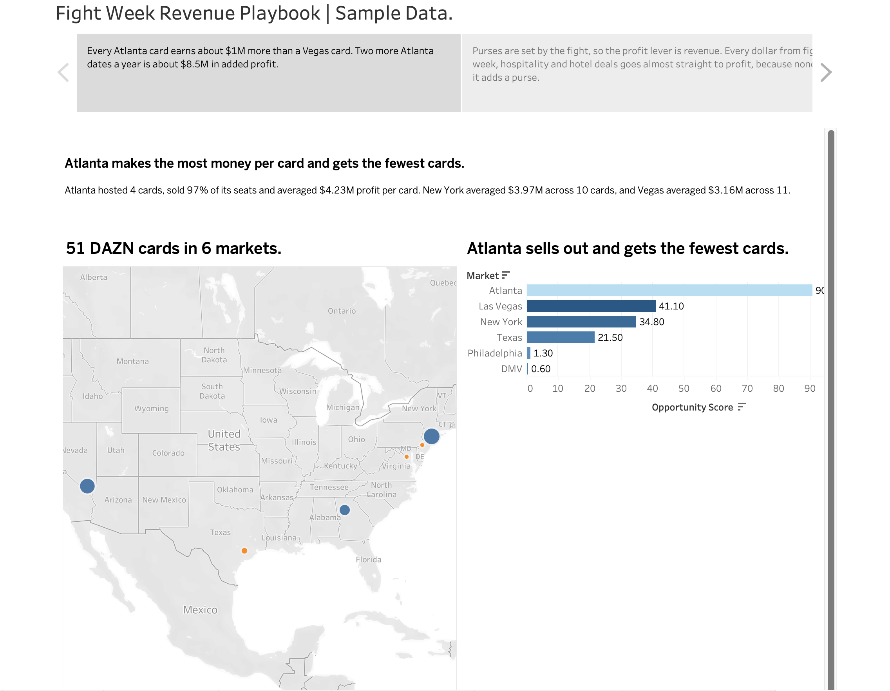

# Fight Week Revenue Playbook

**A profit model for boxing promoters on DAZN, built on synthetic (fake) sample data.**

[View the Tableau story](https://public.tableau.com/app/profile/elisha.rumph/viz/FigthWeekRevenue/FightWeekRevenuePlaybookSampleData_) 

## The Problem

Promoters know what a card grosses. Few can show what each card actually makes after purses, travel, staff, venue, production and marketing, or how much of that profit depends on the DAZN fee. Fight week runs 3 to 4 days, but most of the money is only made on Saturday night.

## What I Did

- Cleaned **39,000+ rows** across 11 messy sources: tickets, buyers, bouts, staff, expenses, fight week events, hospitality, hotels, sponsors and marketing
- Turned money written five different ways ($1.26M, $1070K, 1,350,000) into real numbers, and removed duplicate orders, bouts and invoices
- Priced fighter and staff travel using real fight-week rules (who arrives when, hotel nights, per diems, corner team size)
- Built a **profit and loss for 51 DAZN cards** with break-even sell-through, with and without the DAZN fee
- Turned it into 6 Tableau dashboards and a story

## Key Findings

### The DAZN Factor
- Big cards averaged **$3.66M profit**. DAZN was about 41% of it.
- Mid-sized cards averaged **$417K profit**. DAZN was about 80% of it.
- Without DAZN, **10 of 26** mid-sized cards would have lost money.

### Where to Fight
- Atlanta got the **fewest cards (4)** but sold **97%** of its seats and made the **most profit per card ($4.23M)**.

### The Mid-Sized Playbook
- A hometown contender in a right-sized room (4,000 to 7,500 seats) averaged **$615K profit**.
- Out-of-town names in 18,000-seat arenas averaged **$177K**, and 5 of 6 would have lost money without DAZN.
- Gyms and barbershops sold tickets for **$3.32 each**, compared with **$32.25** for paid social.

### Fight Week and Premium
- **505,000 fans** came to free fight-week events and spent about **$4 each**. Ticketed events earned **$122 per fan**.
- 81% of free fight-week events had no sponsor.
- **96%** of big-card hospitality packages sold out. Ringside and VIP were 12% of orders but 44% of ticket money.

### Selling Earlier
- Mid-sized cards sold **51%** of tickets in the final week. Only 7.5% came through presale, even though repeat buyers bought 68% of tickets.
- Fan hotel blocks were only **44%** booked.

## The Opportunities

| Opportunity | Estimated Profit |
|---|---|
| Two more Atlanta cards a year | about $8.5M a year |
| Turn arena gambles into hometown cards | about $2.6M |
| Price hospitality to match demand | about $2.1M |
| Fight Week Pass and a sponsor for every day | about $1.3M |
| Move marketing money to community channels | about $1.4M in ticket sales |
| Ticket + hotel bundles | about $444K in commission |
| Turn a quarter of comps into paid tickets | about $273K |

## What's Next

Test a mid-sized card in Atlanta between big cards: a smaller room and a cheaper ticket ($109 vs. $251), presold to past Atlanta buyers.

## Tools

- **Python (pandas, NumPy)** in Google Colab for cleaning and the profit model
- **Google Sheets** for hand cleaning and pivot tables
- **Tableau Public** for dashboards and the story
- **GitHub** for the code and data

## Files

| Folder / File | What's Inside |
|---|---|
| `data_raw/` | The 11 messy files, before cleaning |
| `data_clean/` | 14 clean files, including the P&L for every card |
| `images/` | Dashboard screenshots |
| `fight_week_cleaning.ipynb` | The cleaning notebook and profit model |
| `DATA_DICTIONARY.md` | What every file means, plus the travel rules and assumptions |

## See Also

[Fight Night Fan Intelligence](https://rootkitty404.github.io/fight-night-fan-intelligence/): my first project, looking at the same sport from the streaming side.

---

*All data is synthetic (fake). Fighters, promoters, venues, hotels and sponsors are fictional. DAZN fees and costs are assumptions, not real deal terms.*
